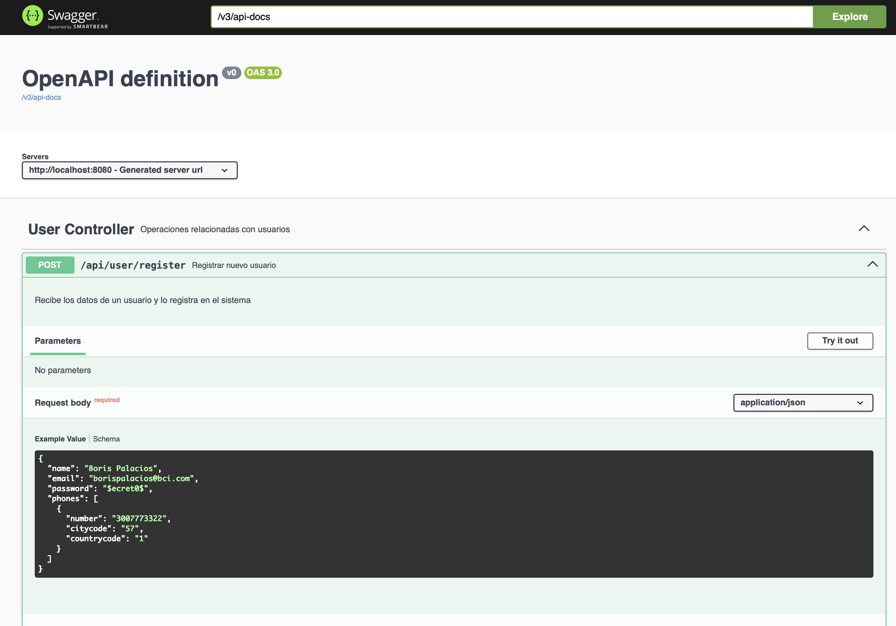
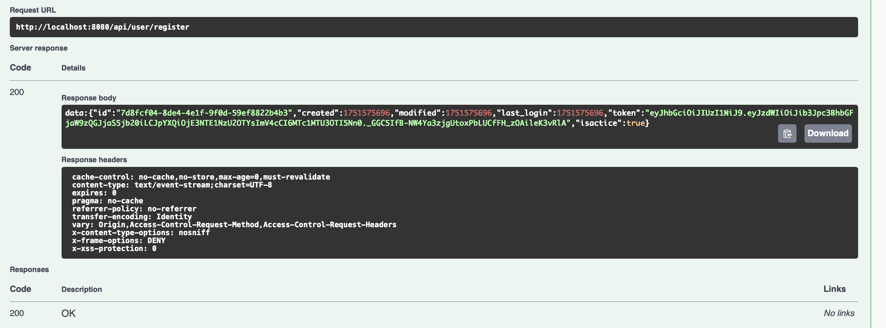
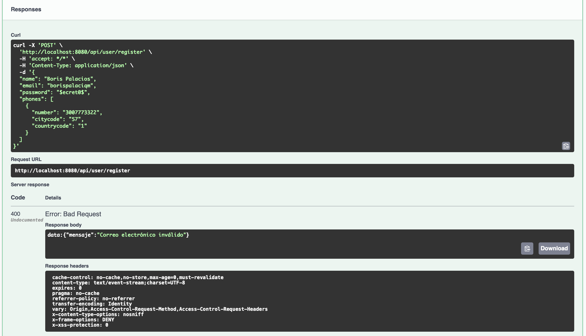

# 📦 Servicio de Registro de Usuarios

Este proyecto implementa un **servicio REST reactivo** para registrar usuarios.  
 
## 📘 Acceso a Swagger

Cuando el backend esté corriendo, accede a la documentación Swagger aquí:

👉 [`http://localhost:8080/swagger-ui.html`](http://localhost:8080/swagger-ui.html)  
o  
👉 [`http://localhost:8080/webjars/swagger-ui/index.html`](http://localhost:8080/webjars/swagger-ui/index.html)

***

### Vista de inicio de sesión

Haga clic en "Try it out" para verificar el endpoint.



### Registro exitoso


### Validaciones



***

## 🧰 Tecnologías utilizadas

- Java 21  
- Spring Boot 3.4.7  
- Spring WebFlux  
- Spring Security  
- Spring Data JPA (con H2 en memoria para pruebas)  
- Hibernate Validator  
- JWT (JSON Web Tokens)  
- Swagger/OpenAPI  
- Maven  
- JUnit 5 + WebTestClient  

***

## 🚀 Cómo ejecutar el proyecto

### 1. Clonar el repositorio

```bash
git clone https://github.com/risbo/user-service-pod001.git
cd user-service-pod001
```

### 2. Ejecutar la aplicación

Verifica que tienes Java 21 y Maven:

```bash
java -version
mvn -version
```

Ejecuta el servicio:

```bash
mvn spring-boot:run
```

El backend quedará disponible en:  
`http://localhost:8080`

***

## 🧪 Cómo ejecutar pruebas unitarias

```bash
mvn test
```

Las pruebas incluyen:

- ✅ Registro exitoso  
- ❌ Email inválido  
- ⚠️ Correo ya registrado  
- ❌ Teléfono con formato incorrecto

***

## 🔐 API REST disponible

### `POST /api/user/register`

Registra un nuevo usuario.

#### Cuerpo de solicitud (JSON)

```json
{
  "name": "Boris Palacios",
  "email": "usuario@bci.com",
  "password": "MiClaveSegura123",
  "phones": [
    {
      "number": "5730077733",
      "citycode": "57",
      "countrycode": "1"
    }
  ]
}
```

#### Respuestas esperadas

- `200 OK` → Usuario registrado  
- `302 Found` → El correo ya existe  
- `400 Bad Request` → Error de validación de campos  

***


## 👨‍💻 Autor

**Boris Palacios**  
Proyecto creado como parte del proceso de selección para **BCI**  
Contacto: bpalaciosa@gmail.com
# user-service-pod001
